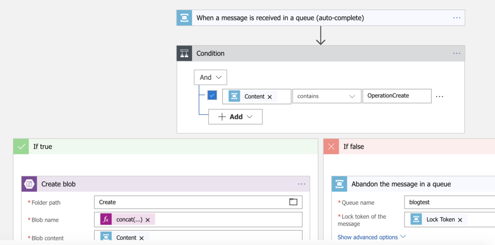

In my first blog post, I investigate a few integration options to connect Dynamics 365 to external systems using Azure Service Bus as a transport layer. 

<!-- end -->

<blockquote style="padding:22px; background-color: #fffbe0; border-color: #ffec82; "/>
<strong>Note:</strong> Microsoft have announced a private preview of Integrated Service Enviroments (ISEs) that may supersede some of the information in this article. <a href="https://docs.microsoft.com/en-us/azure/logic-apps/connect-virtual-network-vnet-isolated-environment-overview" target="_blank"/><u></u>https://docs.microsoft.com/en-us/azure/logic-apps/connect-virtual-network-vnet-isolated-environment-overview</u></a>
</blockquote>

Like many of you I have been presented with the problem of how to perform a two-way integration with another system and Dynamics 365. 

To integrate with an open, cloud based platform with no requirements for complex data transformation, or security hurdles, this is relatively trivial, and can often be done via a bit of C# or JavaScript.

# The Why

Where things get really fun, is where we have to integrate with something that is private. This may be still in the cloud, but requires a secure access token or a certificate which we don’t want to store in Dynamics. Securing secrets in Dynamics 365 is an interesting topic, but one we should probably leave to a later date.

Microsoft treats Azure Service Bus as a first-class citizen to the Dynamics 365 eco-system. They’ve been doing this since CRM 2013. The Plugin Registration tool provides a secure way for us to store configuration data for Service Bus (including secrets) in a way that we all know and love. What’s more this configuration automatically ships with our solutions, so it really fits really nicely within our workflow.

Azure Service Bus is a transport service that Dynamics 365 can use as a bridge to more private endpoints. This means a message can be transmitted across a secure HTTPS channel where it can be picked up in a timely manner by any system that needs to consume it. The main advantage is that the system that needs to consume the message does not need to sit in an unsecure area (such as a DMZ) as long as it has outbound internet connectivity. This is typically done in an asynchronous manner but the same behaviour can be achieved synchronously using WCF or Hybrid relays.

# The How

OK, so how do we go about hooking up something on the other end? Azure has a number of different resources that can handle connections to Service Bus natively.

## Logic Apps

Azure Logic Apps can be triggered by messages arriving in an Azure Service Bus queue. See below.



This designer allows users to easy link their existing Service Bus connection and queues into the Logic App, without having to know the fine details of Shared Access Signatures and the like. It also allows developers to leverage all the connectors and tools without having to write nasty, nasty code.

There is a small issue with this approach however. Logic Apps can only speak to API’s that are exposed to the internet. Due to Logic Apps being a service, it would not even be possible to pin it down to a single ingress IP address. This means logic apps work great for connecting public services with Dynamic, but are not suitable for connecting with business services that may be behind firewalls.

## Azure Functions

Azure Functions allow us to write lightweight simple methods without having to worry about provisioning and configuring compute resources. They allow code to be written in a number of different languages including C#, Java and JavaScript. Functions can be provisioned in two modes: Consumption Plan, and Standard Plan. A Standard Plan works like an Azure Web App, where we specify the compute SKU you want the code to run on and we pay for the uptime. A consumption plan allows a pay-per-execution model, which can be significantly less expensive.

Azure can scaffold the method definition for us, all we need to do is fill in the implementation.

```csharp
using System;
using System.Threading.Tasks;

public static void Run(string myQueueItem, ILogger log)
{
    log.LogInformation($"C# ServiceBus queue trigger function processed message: {myQueueItem}");
}
```
 Obviously function apps are far more configurable, and providing you can code it, it is possible. However consumption plans have managed app services, which means there are no networking options. This means if our function is running as part of a consumption plan, it cannot be part of a virtual network. This gives us the same problem as with the Logic App. However if we’re configure a standard app service plan, we can join virtual networks and call networked services from our function.

## .NET Services
This leaves us with writing services in the good ol’ fashioned way. Microsoft have supplied an updated client library for Azure Service Bus, [Microsoft.Azure.ServiceBus](https://www.nuget.org/packages/Microsoft.Azure.ServiceBus/). This supports .NET Standard 1.3 at the time of writing, which means it is compatible with .NET and .NET Core. 

The compatibility with .NET Core gives us a serious advantage, as we are able to use the [Generic Host pattern](https://docs.microsoft.com/en-us/aspnet/core/fundamentals/host/generic-host?view=aspnetcore-2.2) available in .NET Core 2.1. This is really neat as it allows us to scaffold a host similarly to how we would in the ASP.NET Core Web Host.

Now we can simply write services to consume messages using a QueueClient using a message handler. Remember to complete or abandon your messages when using PeekLock receive mode! We can utilise all of the helpful packages that come in .NET Core, including service configuration and dependency injection. We can even right meaningful unit tests.

These services can be very light weight, stateless and independently scalable. This makes them a terrific match for containerisation, and running these services based on the [Microsoft .NET Core Image on Dockerhub](https://hub.docker.com/_/microsoft-dotnet-core) will give you an image size of approximately 100MB.

## Conclusion
That was a little tour of 3 potential options of how to host integration points for Azure Service Bus integration to Dynamics 365. I’ve summarised them below.

Logic Apps are great if we want a code-less, configurable way to connect Dynamics 365 to any public (or Azure) service using a workflow style editor. It doesn’t support any options for being part of a virtual network, so calling a secured service would require either of the following options to act as a bridge.

Azure Functions allow us to quickly write code and deliver functionality without the requirement of scaffolding, infrastructure or configuration. They can be very cheap to run if configured on a consumption plan, but this causes us to suffer the same problem as Logic Apps. Switching to a standard service plan allows us a way around this.

.NET Services give us infinite generality, we can scaffold and execute out code in any way we want, and thanks to the Generic Host of .NET Core, we can create lightweight services and run them in containers.

Analyse your functional and non-functional requirements, and choose the pattern that works best for you!