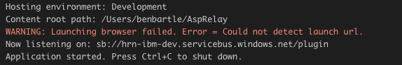
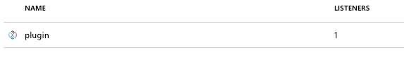

Here we are with another blog post regarding integration patterns. 

<!-- end -->

In my previous post, I went over some of the asynchronous patterns we could use to integrate Dynamics 365 with Azure Service Bus. But today, I want to tackle real-time integrations between Dynamics 365 and ASP.NET Core. 

There are lots of use-cases for when real-time synchronous integration is the only option, a few examples include address validation and completion, product wizards and geotagging. Some of the services that are required for this integration are publicly available, and can even be called from client-side script or via web hooks, but there is often a use-case where we need some piece of validation or calculation to be done via a service which is secured inside a firewall.

In our worked example we will scaffold a simple ASP.NET Core WebApi project that generates an automatically incrementing ID number, which we will consume from a Dynamics 365 plugin. We can then bind these both to a new [Azure Hybrid Connection](https://docs.microsoft.com/en-gb/azure/service-bus-relay/relay-hybrid-connections-protocol) which will act as an automatic load-balancing proxy to secure the connection between them.

## ASP.NET Core WebApi

First of all, let’s fire up [Visual Studio Code](https://code.visualstudio.com/) and scaffold a new project using the command line:

```sh
$ dotnet new webapi
```

This creates us a nice project with a default controller called ValuesController. We’ll use this for the basis of our example. Let’s simplify the controller and add a thread-safe incrementing value on the only HTTP GET action.

```csharp
using System;
using System.Collections.Generic;
using System.Linq;
using System.Threading;
using System.Threading.Tasks;
using Microsoft.AspNetCore.Mvc;

namespace AspRelay.Controllers
{
    [Route("api/[controller]")]
    [ApiController]
    public class ValuesController : ControllerBase
    {
        private static int _currentId = 0;

        // GET api/values
        [HttpGet]
        public ActionResult<int> Get()
        {
            return Interlocked.Increment(ref _currentId);
        }
    }
}
```
Now we can debug this service, or run via dotnet run in the terminal and if we go to the default url (https://localhost:5001/api/values) we will simply get a number that keeps incrementing every time we refresh the page. This is great, but it can only be accessed on our machine. Let’s fix that.

## Hybrid Relay Binding
In this section we’ll create a hybrid connection, and bind our ASP.NET Core App to it.

First of all, log into the [Azure Portal](https://portal.azure.com). We’ll need to create the following resources:

1. A Hybrid Relay Namespace
2. A Hybrid Connection (under the namespace in step 1)
3. A Secured Access Policy (under the connection in step 2)

When we create the Hybrid Connection in step 2, we are given the option of whether or not we want to require client authentication to communicate with the relay. In vast majority of real-world circumstances we want to enforce some authentication. Hybrid Connections use Shared Access Signatures for authentication, which use a concatenation of keys, resource locations and TTL all hashed together. Luckily Microsoft have a [NuGet package](https://www.nuget.org/packages/Microsoft.Azure.Relay.AspNetCore) that allows us to easily bind our existing API to an existing relay, and it’s source code is available to us [here](https://github.com/azure/azure-relay-aspnetserver). We just need to add Microsoft.Azure.Relay.AspNetCore to our project, and add the following line to our HostBuilder configuration.

```csharp
public static IWebHostBuilder CreateWebHostBuilder(string[] args) =>
            WebHost.CreateDefaultBuilder(args)
                .UseStartup<Startup>()
                .UseAzureRelay(options =>
                {
                    options.UrlPrefixes.Add(Environment.GetEnvironmentVariable("RelayConnectionString"));
                });
```
Note here you can use any method of getting the connection string into the setup, I have just chosen environment variables because I want to run this in a docker image later on (but that is for another blog post). In my example I just added the SAS connection string from Azure and when I start debugging, I get the correct output in the console window:



And if we look on the Azure Portal at our hybrid connection it will now show a single listener.



Great, now we have a standard ASP.NET Core WebApi project bound to an Azure Hybrid Connection.

## Dynamics 365 Plugin

Now we have our listener written and running, we need to create a method of calling from within a Dynamics 365 Plugin. We also have to be wary of our secret (the SAS Key) so we have to use the [Secure Configuration Architecture of Dynamics 365](https://community.dynamics.com/crm/b/crmchap/archive/2017/06/11/what-is-unsecure-secure-configuration-on-a-dynamics-crm-365-for-enterprise-plugin). 

## Relay Configuration
Our Plugin needs to know 3 basic things out our relay:

1. The Relay’s HTTPS endpoint
2. A SAS Key Name
3. A SAS Key

In the code example I have linked below, we’ve sorted this out by storing these 3 pieces of information in a JSON string, which we can store in the secure configuration and deserialise as needed. We’ve also created a POCO to deserialise to, called `RelayConfiguration`.

In the code example, I have extracted all the required elements to build the authentication header we need to submit to the relay, and included these in a  `SharedAccessSignatureTokenProvider` class, which is included in a custom `DelegatingHandler` implementation. This basically does all of the leg work for you and allows you to create a new `HttpClient` within the plugin, and providing you pass it a new instance of a `HybridRelayHandler` in its constructor you can use it as if the endpoint were local to Dynamics. The only parameters it needs are from the `RelayConfiguration` we defined earlier.

From this we can easily just use it like any other Dynamics 365 Plugin. In the example below we take the auto-incrementing number and set it to the ticker symbol for any new account. This is a super-simple example, but hopefully you can see how you can use this to call any ASP.NET REST service, with any parameter or return type you desire.

```csharp
public void Execute(IServiceProvider serviceProvider)
        {
            IPluginExecutionContext context = (IPluginExecutionContext)serviceProvider.GetService(typeof(IPluginExecutionContext));
            ITracingService tracer = (ITracingService)serviceProvider.GetService(typeof(ITracingService));

            if (context.InputParameters.Contains("Target") && context.InputParameters["Target"] is Entity)
            {
                tracer.Trace("Parsing Input");
                Entity entity = (Entity)context.InputParameters["Target"];

                tracer.Trace("Parsing Relay Configuration");
                RelayConfiguration config = GetConfig();

                tracer.Trace("Creating HttpClient");
                using (var client = new HttpClient(new HybridRelayHandler(config)))
                {
                    tracer.Trace("Executing Request");
                    var response = client.GetStringAsync($"{config.Url}/api/values").Result;

                    tracer.Trace("Updating Target");
                    entity["tickersymbol"] = response;
                }
            }
        }
```
All of the example code can be found in the following GitHub repository: https://github.com/BenLBartle/d365-hybrid-relay. Any feedback or comments welcome. 