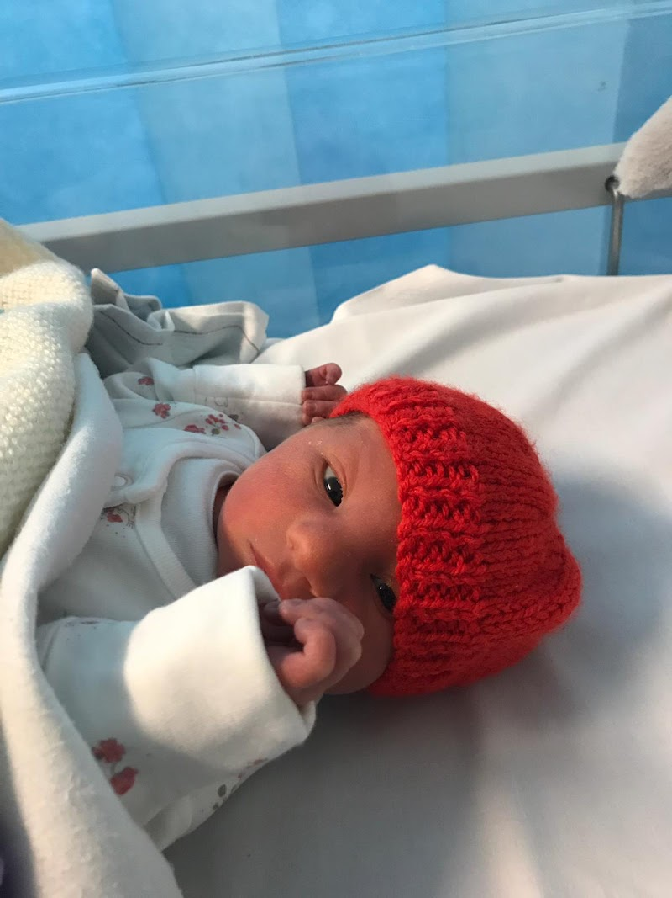
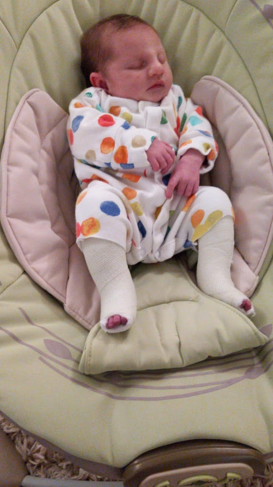

So I haven't posted a blog post in a while, and I have been thinking about writing this down for a long time. Perhaps now is the time to do it.

<!-- end -->

## Purpose

I am writing this story not because I want pity or sympathy, but for two main reaons:

1) Therapy. I am hoping the act of simply writing it down helps me personally, my wife is doing something similar
2) So I don't have to explain it, and that you (the reader) can understand the story and also understand that I am comfortable talking about anything here.

## Rewind, January 2019

So my life was taking a very different direction back in January 2019. I had handed in my notice to IBM, I had formed my own company (Black Waltz consulting for [all you nerds out there](https://finalfantasy.fandom.com/wiki/Black_Waltz)), I had my first contract pending signature about 15 mins away from my house. Fantastic.

Then....

We found out Naomi was pregnant again. 

This was amazing news, as we always wanted a sibling for our other daughter, we were very happy. I got cold feet for contracting, as the prospect of not getting paid for 3 months was a bit intimidating so I decided to stay at IBM (I have subsequently moved on to KPMG) and stay permenant.

But all was well...

## 7th May, 2019

The 7th May is my wedding anniversary, I had it booked off as it was the day after our annual bank holiday camping trip, and it was the day of our 20 week scan. We packed our eldest off to to nursery, and went to the usual place at Milton Keynes University Hospital (MKUH).

That's when things started to go a bit wrong.

For anyone who hasn't been involved in one, a 20 week scan is usually called an anomaly scan, where they take measurements and check the baby over. You can often find the babies biological sex at this scan, but it's not what they're designed for.

All was going well, but the measurements were on the small side, especially for baby's head. Our other daughter is small (she was under 6 lbs when she was born) so the size didn't worry us so much, but it was the disproportionate head size which worried the sonographer. So we were called (after the scan) into the room with the sofa and the flowers in - a room which I have now dubbed the "**Bad News Room**".

We were referred to Oxford John Radcliffe Hospital for a further scan with their foetal medicine team. 

This hit me (probably more than my wife) really hard. There was something about the way they spoke, the fact they didn't charge us for the ultrasound photo that really made me think "Oh shit.".

I rememeber going out for lunch afterwards and trying to digest it. We still didn't know anything for certain, as it was just one scan but it puts that doubt and dread in you. I know people get bad news at scans, I had personally seen it. I just never thought it would be me.

But we knew Maddy would have a baby sister.

## Further investigations

Everyone at Oxford was great. We saw one of their senior consultants and a cardiologist. 

The result (after another visit to Oxfords **Bad News Room**) was that this was likely caused by a chromosome abnormality, and they recommended an [Amniocentesis](https://www.nhs.uk/conditions/amniocentesis/). Our baby was identified as relatively low risk of the common chromosome abormalities during the [combined screening test](https://www.nhs.uk/conditions/pregnancy-and-baby/screening-amniocentesis-downs-syndrome/), but there were now other markers (including rocker bottom feet) which suggested this was the likely cause.

We decided against an Amniocentesis at this point, but were referred for further scans to monitor during pregnancy. 

Sadly things didn't really get any better, and a diagnosis of Microcephaly (small head) was given during the 3rd trimester. We had a late Amniocentesis, but this combined with the micro-array showed no common chromosomal abnormalities.

We were offered an ante-natal MRI, but decided against it as it was unlikely to provide a definitive diagnosis of any issues with brain structure that could not be picked up using normal ultrasound. 

Microcephaly is normally associated with conditions such as epilepsy and delayed cognitive development, but is a spectrum condition where some children can grow up relatively normally.

I think a late stage termination was on the table, legally and medically, but we knew it was something we could never do.

After a last minute concern about placental function, we were booked in for an induction at 38 weeks gestation.

The last few weeks were hard, we had to have so many scans and so much time on the monitor. We were kind of sick of ifs and maybes and we were just ready to meet our baby and take the next step forward.

## 8th September, 2019

Lukily even when induced my wife's labour does not mess about, and early on Sunday morning our 2nd daughter - *Sophie Florence Bartle* was born. 

We had a paedeatrician in the room with us, neo-natal bed on standby. Sophie was handed to the doctor, given the once over, and then handed back to my wife. We didn't have to go to neo-natal. She had a red hat because she was high risk.

She weighed 2.1kg, or 4lb 10oz. 

Her microcephaly was not as pronounced as first expected, her feet were upturned (we said she had funny frog feet). Our midwife was bloody amazing, and made sure baby was given to me so my wife could have a shower before we went to post-natal. By the afternoon, Maddy was meeting her sister and she has loved her to pieces from this moment onwards.

Oh, I forgot to say, she started school for the first time 3 days before this. She is amazing.

We spent 4 days in hospital which wasn't really much fun and we were desperate to get out, but it could've been worse. We saw her new paediatrician (who also helped our older daughter with her SVT). 

We saw an orthapedic consultant in the first few days and was referred into his clinic for her feet. 

## Going home

We were very happy to get home, and I enjoyed the rest of my paternity leave with her. We started to get used to her, and how she worked. She was a lot sleepier than our previous child, often we had to work hard to wake her for feeds! I was commuting daily to London from the first day back after paternity leave, which was fun.

We had an MRI done which showned no massive abormality in her brain structure, had some genetic testing done and started treatment on her feet. 

She had to have both her feet in casts for several weeks, which was really frustrating as the one thing Sophie loved more than anything was getting in the bath.

After a while they gave us some stretching to do and she could have so cast free periods. We haven't been in casts for a long time now due to lockdown - but we are resigned to probably having to go back into them again and possibly surgery, but that is not for now.

