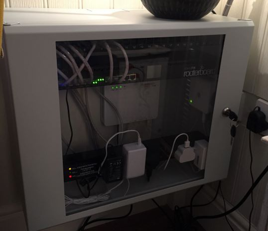

I've been using Unraid for my NAS, Backup and Media servers at home, and here is why it's awesome.

<!-- end -->

I've recently been rebuilding our home IT setup. Our old setup was based around our needs in the our old house, but since we moved to a much larger house (with much thicker walls) I've had to sort out the networking and IT setup to better fit with our needs.

## The Setup

In my house I have the following setup:

### Dining Room/Play Room

This is where the BT master socket is, and whilst not ideal this is what I have to work with. So in this room (in a 9U low-profile cabinet I have the following):

- 24-port Cat-6 patch panel
- Mikrotik RB2011RM Router (running RouterOS)
- BT VSDL Modem
- BT Mesh Wifi Disk
- Hive Smart Home Hub

This provides the connection for the mesh network (I have 3 other disks) into the router which provides the wifi for the house. DHCP is handled by the router (I have 256 reserved static IP addresses, the rest are handled by DHCP) and I have 4 gigabit ports bonded together (in LACP) that run out the back of the cabinet, along the wall and up through the ceiling. This leads to the:

### Study/Spare Room

Here the 4 cat-6 cabled enter another 18U cabinet which has:

- 24-port Cat-6 patch panel
- HP ProCurve 2510G-24 Gigabit Managed Switch
- HP ProCurve 2510G-48 Gibabit Managed Switch
- PS3
- PS4
- Xerox Phaser 6125N Colour Laser Printer (sitting on top of the cabinet)
- Modded 2U SuperMicro Storage Server

Phew.

In this room I also have 2 desktop PC's (for me and the wife):

- Dell XPS 8300 (i7-2600 - 4C/4T, 8GB RAM, Radeon HD 6770) - for the wife
- HP Z800 (Dual Xeon X5675 - 6C/12T, 48GB RAM, GTX 980Ti) - for me, it's what I am typing on now. This thing is sick, it has 24 Logical Cores. Seriously, buy one of the X58 HP Z-series workstations, they are super cheap and built like tanks.

As well as my work laptop, which is a standard build.

As you can see from the photo above, I am not running the 48 port switch at the moment (I got it for a steal) but it can be used at a later date, but you can see the 4 yellow uplink ports which are bonded together for bandwidth and redundancy.

I said the SuperMicro was modded? Yeah. It is. Try running something designed for a rack mount where you want to work. Those things have 7000RPM fans which are **super loud**! So I decided rather than have some 80mm fans suck air from the inside, I'd have trio of Noctua 140mm fans blowing air directly into the system, over the drive bays and over the CPU and RAM. It is a LOT quieter.

And it seems to be working so far. I made the housing from some threaded bar, and 2 lots of anguled aluminium. It has the slightly annoying side-effect of blocking access to the hot-swap bays and the power button; but it has IPMI onboard so I can easily power the thing up or down with an app on my phone.

It's got a Xeon L5630 (4C/8T) (*have I told you how much I love the X58 platform?*) but will take 2; and 24GB of DDR3 ECC Registered RAM. The ECC is really important when running this as a NAS.

Oh and it's also got 6 3TB SAS Drives, 2 TB SATA Drives and 2 240GB SSDs. More on this later.

## FreeNAS or Unraid - that is the question

So I was forced to choose quickly between **[FreeNAS](https://freenas.org/)** or **[Unraid](https://unraid.net/)** for the OS on the box. I tried both but quickly settled on **Unraid** for the following reasons:

1) It's software RAID was just more flexible, I didn't have to add drives in even groups all the same size, and I could dynamically expand the array as I need to.
2) In the scary eventuality of a dual drive failure, I would likely only lose the data on the one drive, rather than the whole array. 
3) It's options over and above a basic NAS were incredible
4) Although it's proprietary software, the community looked great, and there were some people making some great stuff for the platform.

## Unraid

So Unraid works using software RAID, which means you do not need a hardware RAID card, in fact if you use one it won't work. You either need a dedicated HBA, or a RAID card flashed to IT mode to act as a HBA. This basically means the OS sees the drives indvidually, rather than arrays abstracted by a hardware RAID card.

The way it works is when you build your array, you nominate one or more of your drives as a parity drive. This means that if a drive in your array fails, you can rebuild the array using the parity information stored on that drive. But what's different about this compared to [ZFS](https://en.wikipedia.org/wiki/ZFS) in FreeNAS, is that the non-parity data is not striped across all the remaining drives, it fills up the drives one-by-one (based on a [high water allocation method](https://wiki.unraid.net/Un-Official_UnRAID_Manual#High_Water)). This means that if a drive fails, you have only lost the data on *that particular drive* and should the parity drive then fail, you are in a better position than losing all the data in the array (which would happen on a RAIDZ1 pool with two drive failures). 

The downside to this? Well because you're only ever writing to one drive at a time, it means your write speed is restricted to the speed of that drive, as it cannot stripe the data over multiple physical disks. 

### Cache drives

Thankfully, the clever dudes at Unraid have thought of a solution to this problem: Cache drives. Cache drives act as a write cache, and allow us to defer the writing of files to the protected array until later. They do this by being SSDs. I have 2 240GB SSDs configured in a btfs RAID1 pair (mirror). This means when I push data onto the array, Unraid is smart enough to allow me to quickly write this to the SSDs. Then it can move the files off the cache to the HDDs in the array at a later date.

You could in theory make this even faster by forgoing redundancy in the Cache pool and configuring it in RAID0 - but unless you're moving lots of small files the bottleneck will be your gigabit ethernet link. 10Gbe is still to expensive in 2019, for me anyway.

### Backups and Docker

So with that setup above I have an array of 16.3TB. Sweet.

But do you know what the best thing about So the best thing about Unraid? It supports docker NATIVELY.

This means pretty much any service you can think of will run on this box, and the community has really come to the fore here.

Want Plex to spin over your media? *Just install a docker container*.

Want to use Duplicati to sync your data to the cloud? *Just install a docker container*.

Want to use Replicati-sync to automatically back up your phones photos to the NAS? *Just install a docker container*.

It truely is an amazing platform. Thanks to this software I have 16TB of protected storage, with automatic backups of the key data (important documents, photos etc - stuff that if the house burned down I would want to keep) synced into Azure Blob storage on a regular basis.

## Links

[Unraid Product Info](https://unraid.net/)

[Unraid Community Forum](https://forums.unraid.net/)

