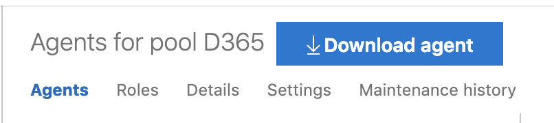
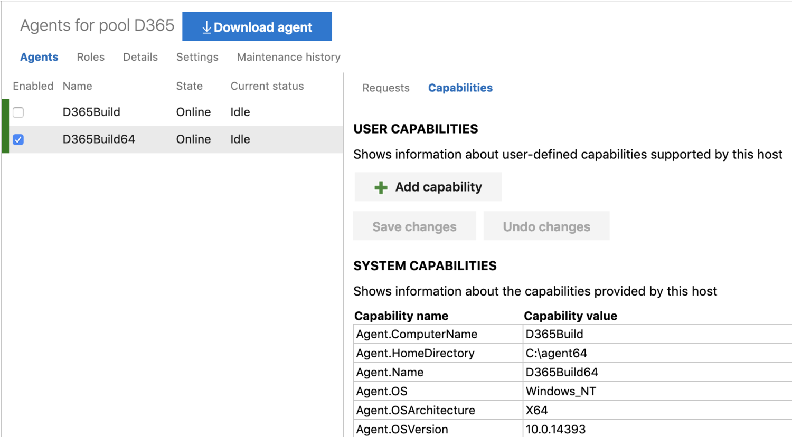
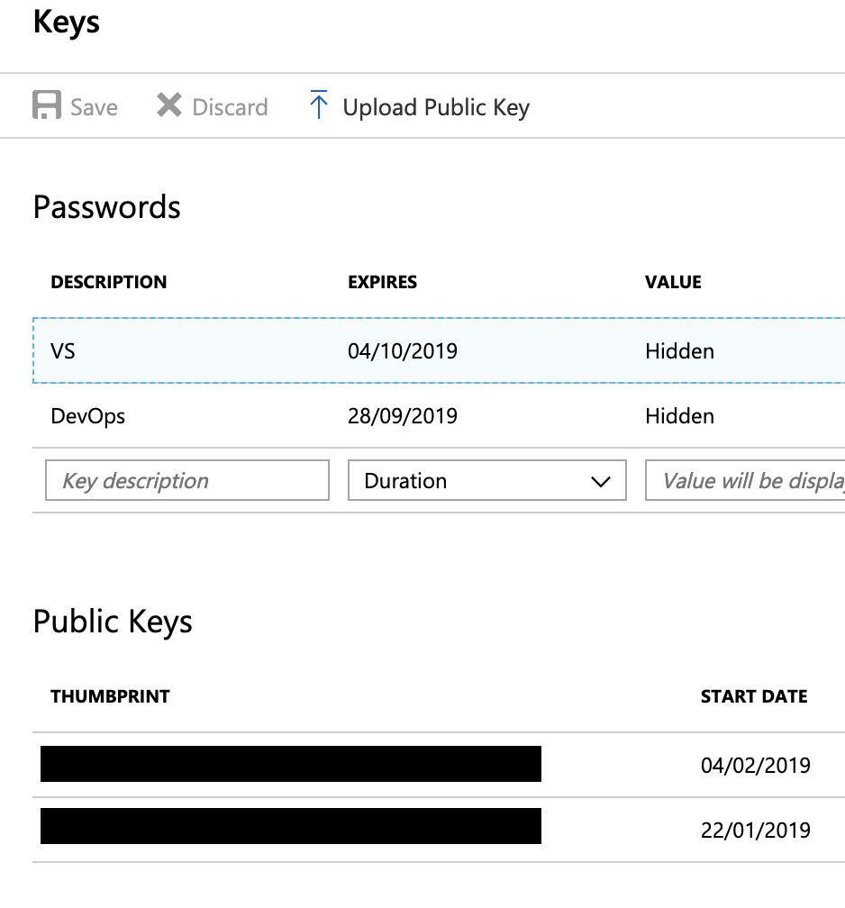
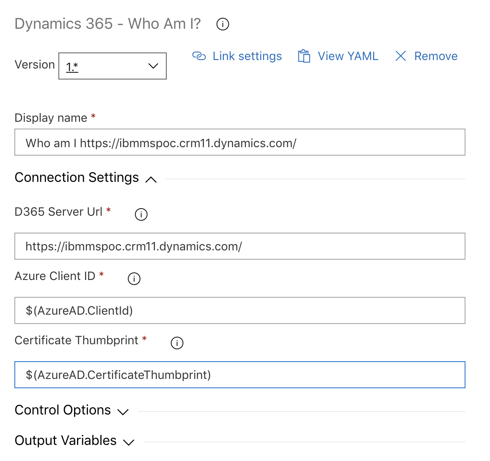
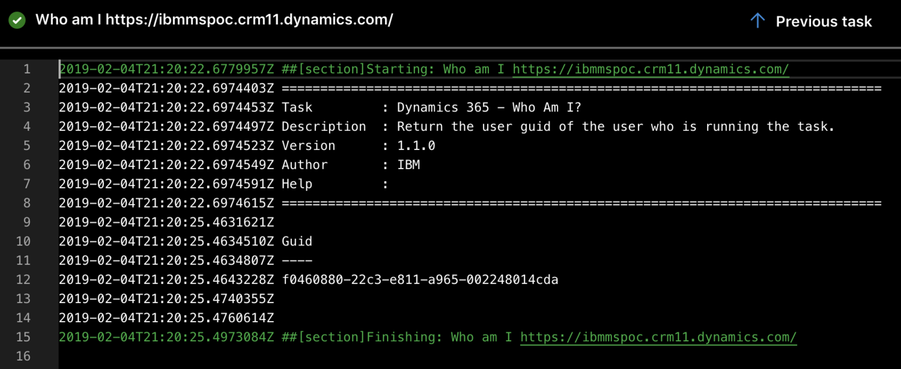

In this blog post we investigate how to secure Azure DevOps pipelines to Dynamics 365 using Certificate-based authentication.

<!-- end -->

We’ve come a long way with programmatic logon to Dynamics 365. It seems like only yesterday we had plaintext usernames and passwords in configuration files and/or hardcoded credentials in TFS XAML Builds.

This blog post is to show how we can better secure our pipelines by using Azure AD Application Users and Certificate Based Authentication.

# But why?

The main reason we want to use Azure App Registrations and Certificate based auth is for security. When using a Username/Password combination or a Client Credential (ClientId and Client Secret) they are susceptible to compromise. All our authentication is done by tokens that anyone can use as long as they **know** them. By adding a client certificate we harden our security as now to authenticate you need to **know** something (the thumbprint) and to **have** something (the private key, aka the certificate). This is the same principal behind Multi-Factor Authentication (which we all use, right?!)

## Getting Started - Configuring a Build Agent

In order to use Certificate Based Authentication in Azure DevOps, we’ll need a custom build agent. For many other tasks we can use the hosted agent, but if we want to protect our resources we’ll need a custom agent to install our certificates on. This can be any Windows Machine, I used a Server 2016 DataCenter VM, but you can simply use your own laptop if you want.

Connect to Azure DevOps from the machine, log-in as an Administrator and navigate to Organization Settings, and then select Agent Pools. I created a new Agent Pool here, but if you want you can just use the default.

Click the **Download Agent** button as per the screenshot below, and download the correct version of the agent for your machine. ***Take care here***, as it defaults to the 32-bit version of the agent, which wasted a lot of my time and I ended up having to go back and install it again.



Follow the instructions on the download page, and then on the configuration process (you will need a [Personal Access Token](https://docs.microsoft.com/en-us/azure/devops/organizations/accounts/use-personal-access-tokens-to-authenticate?view=azure-devops)) and then you should see your new custom agent listed in your agent pool.



## Self-Signed Certificate

The next thing we need to do, is generate a self-signed certificate for use in the authentication process. We can do this using the `GenerateCert.ps1` PowerShell script which is included in the [GitHub Repo](https://github.com/BenLBartle/d365-cert-azure-devops). This will prompt us for the FQDN (doesn’t really matter, but should be pretty descriptive), the private key password and the file path to export the PFX file.

This will add the certificate to the Current User’s personal certificate store. We’ll need to import the PFX file to the Build Agent (if this is not your current machine) making sure you check the box that allows the Private Key to be exported. Be aware that the service account running the Build Agent will need to have access to this certificate so make sure you install it in the correct store. 

## Uploading Public Key

In order for Azure to validate our certificate we’ll need to upload our public key to the Azure Application which is registered against our Application User. To do this, we need to export our Public Key from our Certificate Store. This needs to be the public key only (the *.cer file).  This can be done from the Keys menu within the App Registration Settings. Once this is complete you’ll see the Certificate Thumbprint in the Azure Portal, keep a note of this as you’ll need it later.



## Building the Custom Task

Now we’ve deployed all the authentication artefacts we can set about building and deploying our custom Azure DevOps task.

The `IBM.AzureDevOps.CertExample` folder contains a class project with a custom PowerShell Cmdlet and Script. Build the solution, and take a copy of the output directory.

In order for the custom task to run successfully when deployed on a build agent, the `VstsTaskSdk` PowerShell module must be packaged in a sub-folder named `ps_modules`. The folder structure should be as follows:

`IBM.AzureDevOps.CertExample/bin/<configutation>/ps_modules/VstsTaskSdk/`

The VstsTaskSdk module can be downloaded from the [PowerShell Gallery](https://www.powershellgallery.com/packages/VstsTaskSdk/0.11.0).

### Uploading the Custom Task
We need to install the tfx command-line utility using npm and the following command:

```sh
npm install -g tfx-cli
```

Once the install has been completed, log into Azure DevOps using the following command:

```sh
tfx login
```

We will be prompted for a Server Url and a Personal Access Token. The Server Url will need to be at the Project Collection level, so in my case was https://bbartle.visualstudio.com/DefaultCollection/

Upload the task using the following command:

```sh
tfx build tasks upload --task-path <path>
```

## Configuring an Azure DevOps Pipeline
Now we have everything uploaded into Azure, Azure DevOps and our Build Agent we can configure our Pipeline.

Create a new Build Pipeline, select our new Agent Pool (rather than the default of Hosted) and add a new Task to our agent job. We’ll need to select our custom task from the Utility sub-menu (unless you changed the task.json) which will prompt us for the 3 input parameters of the PowerShell script. You can simply input the values for testing, but it is best practice to have these as secret variables.



Once this is done, queue a build and watch the output. You should see the current users guid returned in the output.



All of the source code is available in the repo below.

https://github.com/BenLBartle/d365-cert-azure-devops

## Acknowledgements
Thanks for the inspiration (and starter code) to Marius Agur Lind (aka the [CRM Viking](https://community.dynamics.com/crm/b/crmviking)). I took some of his examples and PowerShell code from [this blog post](https://community.dynamics.com/crm/b/crmviking/archive/2018/04/04/dynamics-365-s2s-oauth-authentication-with-certificates).