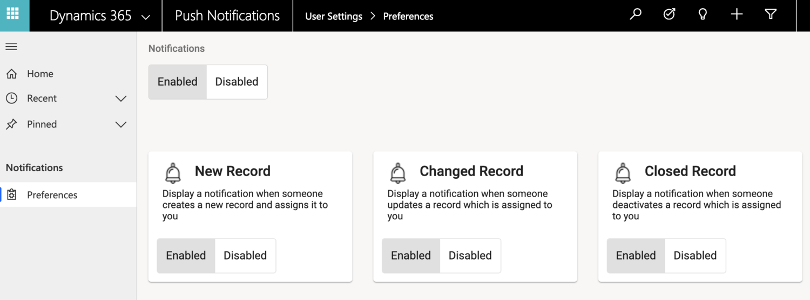
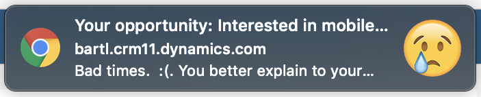
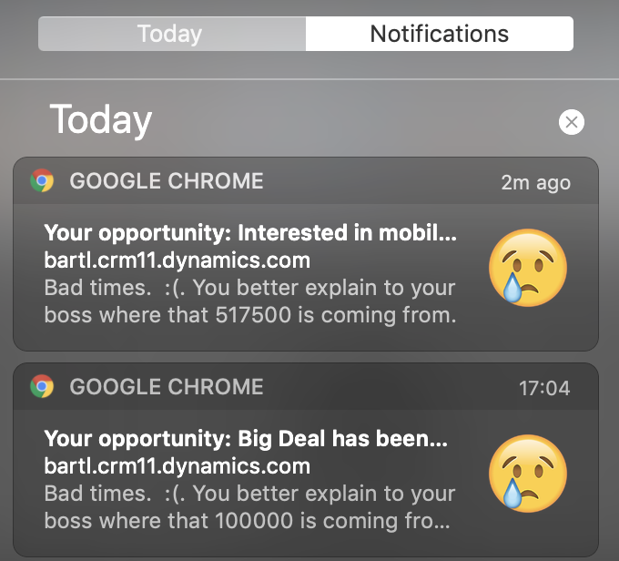

Here is an overview of how we can enable push notifications in Dynamics 365.

<!-- end -->

For a while now I have been mulling over notifications in Dynamics 365. Notifications become a thing on all project, and most of the time they end up being nothing but a bunch of badly formatted emails that no-one ever reads but just clog up your inbox. And it made me think:

> Surely there must be a better way?

So it made me look at Progressive Web Apps (PWA’s) and how they handle notifications. You know, how facebook has told you that your friend has tagged you in a post about whether pineapple should be allowed on pizza (answer: it shouldn’t, but we won’t get into that here).

PWAs offer these push notifications that just work with modern browsers, using a bit of magic called a [service worker](https://developers.google.com/web/fundamentals/primers/service-workers/).

So after many late nights googling, browsing stack overflow, swearing, and a little bit of coding I present a preview of Push Notifications for Dynamics 365.

## Enabling

So this should work in any modern browser (IE users you may be out of luck) using Firebase Cloud Messaging and capturing your consent via a custom web resource in Dynamics. Luckily this can be embedded directly in a model-driven app using the site map editor. Angular Material’s default theming also matches the Unified Interface really well:

Using this we can capture a user’s consent for notifications using the standard ‘Do you want to allow this website to send you notifications’ functionality that exists within the browser. Then we can store the consent token in a new record within Dynamics. This works quite nicely as we can use the security model to stop users seeing each other’s consent tokens.

I’ve just done 3 different notification triggers as a proof of concept, but these could be so open ended. Some ideas I’ve had so far:

* Notification when you are assigned a new record
* Notification when your SLA is expiring and/or expired
* Notification when a VoC or Forms Pro survey is completed
* Notification when a case is raised against your account

I’d like to see if we can embed this on a portal, and do notifications out to customers, but that is for another day.

Notifying
Once we’ve captured the consent token, we can use anything we want to trigger notifications to the user. I’ve done mine using a Logic App, but you could use anything you want: Plugins, Workflows, Flow, you could even send them via JavaScript. Below is an example of how one shows in Chrome on a Mac, looks like I need to work harder to close deals.

The cool thing is this is integrated directly into the browser, the user doesn’t need to install any software on their system for these to work. They just pop-up when the user doesn’t have the tab open. **They do not even have to have the browser open**. These notifications are super configurable as well, we can personalise the text, icon, click-action to be whatever we want. It even integrates with both the Mac and Windows notification centres!

I will record a video tomorrow showing how this all works. But I think it could be really awesome on future projects, and I plan to keep working on it going forward.

Update

Video added below.

<iframe width="643" height="361" src="https://www.youtube.com/embed/eUlMnQiz27Y" frameborder="0" allow="accelerometer; autoplay; encrypted-media; gyroscope; picture-in-picture" allowfullscreen></iframe>
